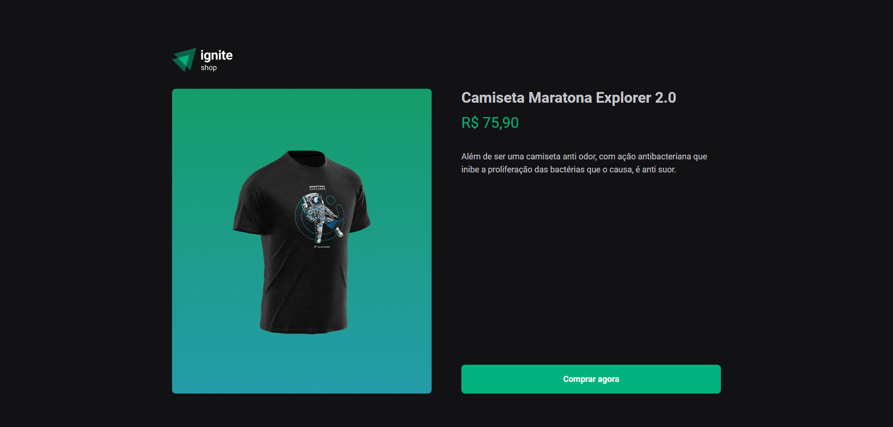
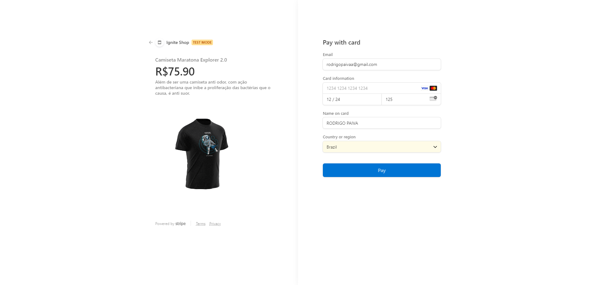
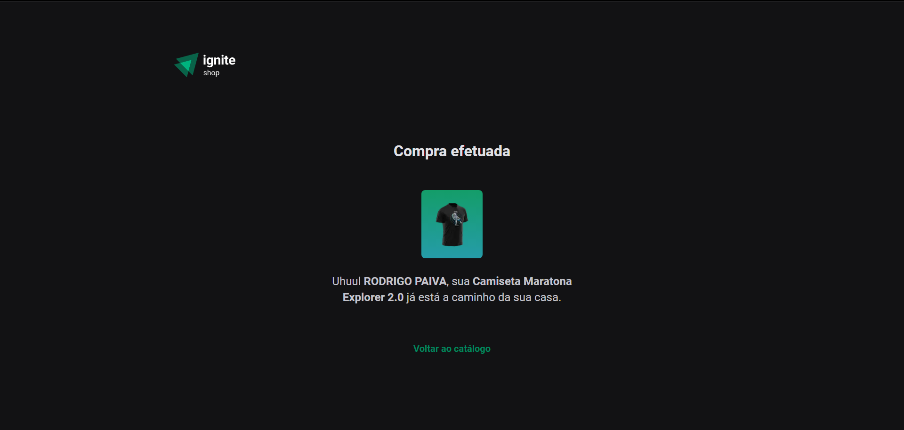

<h1 align="center">Ignite Shop</h1>


### Aplicação desenvolvida no curso de especialização da Rocketseat.

<br><br>
## Como executar a aplicação ⚙️

### Executar os seguintes comandos...

``` js
  npm install
```
- Para instalar as dependências da aplicação

``` js
  npm run dev
```
- Para executar a aplicação
<br><br>


## O que foi desenvolvido 🚀
Uma página de compras com um carrossel em torno dos produtos; Utilizando do stripe para verificação e ponte de pagamento.

<h3 align="center">Página inicial</h3>

<br><br>

<h3 align="center">Página do produto</h3>

<br><br>


<h3 align="center">Página de verificação do stripe</h3>

<br><br>


<h3 align="center">Página de sucesso na compra</h3>

<br><br>


<br><br>
## Como foi desenvolvido 📋

### Tecnologias utilizadas
- ReactJS
- Typescript
- Stitches
- Next.JS (sem o uso de UseRouter)
- Stripe
- VsCode


